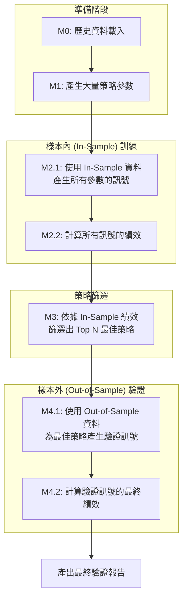

# QUANTA II 系統開發說明文件：v2.0 In-Sample / Out-of-Sample 架構

## 開發目標

建立一套模組化、可擴展、且包含**樣本內 (In-Sample) 訓練**與**樣本外 (Out-of-Sample) 驗證**流程的量化交易回測系統。系統核心流程分為以下模組：

*   **M0：歷史資料載入模組 (`m0_data_loader.py`)**
*   **M1：策略參數產生模組 (`m1_param_generator.py`)**
*   **M2：樣本內 (In-Sample) 回測模組 (`m2_signal_generator_batch.py`, `m2_performance_from_signals_batch.py`)**
*   **M3：最佳策略篩選模組 (`m3_strategy_selector.py`)**
*   **M4：樣本外 (Out-of-Sample) 驗證模組 (`m4_1_validation_signal_generator.py`, `m4_2_validation_performance.py`)**

---

## 🚀 系統執行流程

新的架構核心在於將策略的「探索」與「驗證」分離，避免過擬合 (Overfitting)。



---

## 📂 資料夾與檔案總覽

新的檔案結構圍繞 `in_sample` 和 `out_sample` 組織，以確保數據和結果的清晰隔離。

```
QuantaIII/
├── data_csv/                       # M0 輸出：歷史價格 (CSV)
├── strategies/
│   ├── in_sample/
│   │   ├── all_params/             # M1 輸出：所有策略的參數組合 (JSON)
│   │   └── best/                   # M3 輸出：樣本內最佳策略 (CSV)
│   └── out_sample/
│       ├── param_logs/             # M3 輸出：最佳策略的詳細參數 (JSON)
│       └── best/                   # M5 輸出：最終驗證後的最佳策略 (CSV)
├── signals/
│   ├── in_sample/                  # M2.1 輸出：樣本內所有策略的訊號 (CSV)
│   └── out_sample/                 # M4.1 輸出：樣本外最佳策略的訊號 (CSV)
├── performance/
│   ├── in_sample/                  # M2.2 輸出：樣本內所有策略的績效 (CSV)
│   └── out_sample/                 # M4.2 輸出：樣本外最佳策略的績效 (CSV)
├── modules/                        # 所有模組實作
│   ├── m0_data_loader.py
│   ├── m1_param_generator.py
│   ├── m2_signal_generator_batch.py
│   ├── m2_performance_from_signals_batch.py
│   ├── m3_strategy_selector.py
│   ├── m4_1_validation_signal_generator.py
│   ├── m4_2_validation_performance.py
│   └── m5_validation_strategy_selector.py
└── utils/                          # 共用工具函數
```

---

## 🧩 各模組功能與輸出說明

#### 🔹 M0: 資料載入 (`m0_data_loader.py`)
*   **功能**: 從 CSV 檔案讀取歷史股價資料，並可存入 SQLite 資料庫。
*   **輸出**: `database/stock_price.db`

#### 🔹 M1: 參數產生 (`m1_param_generator.py`)
*   **功能**: 為指定的策略（如 RSI, CROSS）自動產生大量的參數組合。
*   **輸出**: `strategies/in_sample/all_params/param_log_*.json`

#### 🔹 M2: In-Sample 回測 (`m2_*_batch.py`)
*   **功能**: 根據 M1 產生的所有參數，在**樣本內**資料上執行大規模、並行化的訊號生成與回測。
*   **核心**:
    *   `m2_signal_generator_batch.py`: 產生包含所有策略訊號的單一大型 CSV 檔。
    *   `m2_performance_from_signals_batch.py`: 讀取上述訊號檔，計算每個策略的績效。
*   **輸出**:
    *   `signals/in_sample/SIGNALS_*.csv`
    *   `performance/in_sample/PERFORMANCE_*.csv`

#### 🔹 M3: 最佳策略篩選 (`m3_strategy_selector.py`)
*   **功能**: 讀取 M2 的樣本內績效報告，根據指定指標（預設為 `sharpe`）篩選出表現最佳的策略。
*   **核心**:
    1.  找到績效最好的 Top N 個 `param_id`。
    2.  將這些 `param_id` 的績效摘要儲存起來。
    3.  從 M1 的 `param_log` 中，找到這些 `param_id` 對應的完整參數，並複製到 `out_sample` 目錄以供 M4 使用。
*   **輸出**:
    *   `strategies/in_sample/best/best_strategies_*.csv`
    *   `strategies/out_sample/param_logs/param_log_*.json` (只包含最佳策略的參數)

#### 🔹 M4: Out-of-Sample 驗證 (`m4_*.py`)
*   **功能**: 使用 M3 挑選出的最佳策略，在**樣本外**的歷史資料上進行回測，以驗證策略的真實表現。
*   **核心**:
    *   `m4_1_validation_signal_generator.py`: 自動讀取 M3 篩選出的最佳策略參數，在 Out-of-Sample 資料上產生訊號。
    *   `m4_2_validation_performance.py`: 自動讀取 M4.1 產生的訊號檔，計算最終的樣本外績效。
*   **輸出**:
    *   `signals/out_sample/SIGNALS_*_validation.csv`
    *   `performance/out_sample/PERFORMANCE_*_validation.csv`

---

## 🧠 系統設計原則與變更
*   **In-Sample / Out-of-Sample 分離**: 這是最重要的變更，旨在透過獨立的驗證集來測試策略的穩健性，有效降低過擬合風險。
*   **自動化流程**: M3 和 M4 之間的流程是自動化的。M4 會自動尋找 M3 產生的最新最佳策略檔案進行驗證，無需手動指定。
*   **批次處理**: M2 模組採用批次 (batch) 處理，能夠高效地對數千個參數組合進行回測。
*   **檔案命名**: 檔案命名規則清晰，包含模組、日期、`in_sample`/`out_sample` 等關鍵資訊，易於追蹤和管理。
*   **低耦合**: 模組之間依然透過檔案系統進行數據交換，保持了系統的靈活性和可維護性。
